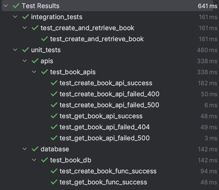
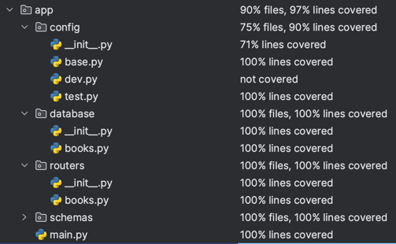

# PYTHON CODING CHALLENGE: REST API ON FASTAPI

## Table of Contents
  * [Assumptions](#assumptions)
  * [Database Design](#database-design)
  * [Prerequisites](#prerequisites)
    + [For Deployment](#for-deployment)
  * [Environment Preparation](#environment-preparation)
    + [Setting Up Virtualenv (Optional)](#setting-up-virtualenv-optional)
    + [Install Dependencies](#install-dependencies)
  * [Run API Server (Locally)](#run-api-server-locally)
  * [Deployment Using Serverless Framework](#deployment-using-serverless-framework)
    + [Setup Serverless Framework](#setup-serverless-framework)
    + [Setting Up AWS & CLI](#setting-up-aws--cli)
    + [Deploy The App To AWS Using Serverless Framework](#deploy-the-app-to-aws-using-serverless-framework)
  * [Testing](#testing)
    + [Test Cases](#test-cases)
    + [Test Coverage](#test-coverage)
    + [Run Tests](#run-tests)

<!-- TOC end -->

## Assumptions

- (1) In this challenge, `author` is just a reference string to "an author". 
- (2) The challenge didn't mention anything about `author`, so I assumed we wouldn't need to query documents using `author` nor care about possible attributes of `author`. Therefore, I only use regex to check the format of the author ID without checking the existence of the `author`.
- (3) Users only query using `id` of the book.
- (4) Upon creation, users don't need to send an `id`. The system would automatically generate an unique key for it.


## Database Design

As stated in the assumptions, `author` is just a reference string & we only query books using `id`. 

So I chose the schema design as follows:
```
- Table: Books
- Partition key: id         (eg: "/books/1aeddb84-24db-4aca-a98f-ae43a2499a8a")
- Sort key: None            
```

In other cases, if we want to extend the system by introducing `author` or querying using it, I suggest doing the following to show the "relations" between `author` and `book`:
```
a) Redesigning the schema to:
- Partition key: author     (eg: "/authors/d953185e-1ab7-4860-a0e8-31020d6ebb6d")
- Sort key: book_id         (eg: "/books/1aeddb84-24db-4aca-a98f-ae43a2499a8a")

And duplicate author information (attributes) for each item.

b) Create a separate table `Author` to store authors.
```

## Prerequisites
- Python 3.8+
- AWS Account with access to AWS DynamoDB, AWS Lambda, AWS API Gateway.
- AWS CLI v2.

### For Deployment
- Node.js (for Deployment / Serverless Framework)
- Serverless Framework.


## Environment Preparation

### Setting Up Virtualenv (Optional)
```
$ pip install virtualenv
$ cd ./wf-books-api
$ virtualenv venv --python=python3.8
$ source ./venv/bin/activate
```

### Install Dependencies
```
$ pip install -r requirements.txt
```


## Run API Server (Locally)
```
$ export ENV=dev
$ export AWS_ACCESS_KEY_ID=your-aws-access-key               # if you have setup AWS CLI, this is optional
$ export AWS_SECRET_ACCESS_KEY=your-aws-secret-access-key    # if you have setup AWS CLI, this is optional
$ export DB_DYNAMODB_TABLE=dynamodb-table-name               # default: "Books-dev" for dev / "Books-test" for test
$ export DB_REGION_NAME=region-name                          # default: ap-southeast-1
$ uvicorn app.main:app [--reload]                            # start the app
```


## Deployment Using Serverless Framework

### Setup Serverless Framework

Make sure you have the latest version of Node.js.

Visit https://www.serverless.com/framework/docs/getting-started and follow the instructions to setup Serverless Framework.

### Setting Up AWS & CLI

Visit https://aws.amazon.com/cli/ and follow the instructions. After that, run the command:

```
$ aws configure
```

### Deploy The App To AWS Using Serverless Framework

```
$ cd /path/to/wf-books-api
$ sls deploy
```

Follow the instructions to deploy (if any).

This will deploy:

- Deploy AWS Lambda function.
- Create proper IAM for the Lambda.
- Create a AWS DynamoDB table.
- Expose a URL to access the API through AWS API Gateway.


## Testing

### Test Cases



- Integration tests (Using live external DB):
  - `test_create_and_retrieve_book`: Test the whole flow (book creation -> book retrieval) using an external and live DynamoDB.
- Unit tests (Using mocked DB):
  - API / Endpoints:
    - `test_create_book_api_success`: Test create book successfully -> HTTP 201
    - `test_create_book_api_failed_400`: Test create book unsuccessfully (incorrect data) -> HTTP 400
    - `test_create_book_api_failed_500`: Test create book unsuccessfully (exceptions) -> HTTP 500
    - `test_get_book_api_success`: Test get book successfully -> HTTP 201
    - `test_get_book_api_failed_400`: Test get book unsuccessfully (not found) -> HTTP 404
    - `test_get_book_api_failed_500`: Test get book unsuccessfully (exceptions) -> HTTP 500
  - Database:
    - `test_create_book_func_success`: Test function to create book
    - `test_create_book_func_success`: Test function to get book


### Test Coverage



Results: `97% lines covered` for `app`


### Run Tests
```
$ export ENV=dev
$ pytest tests/
```
